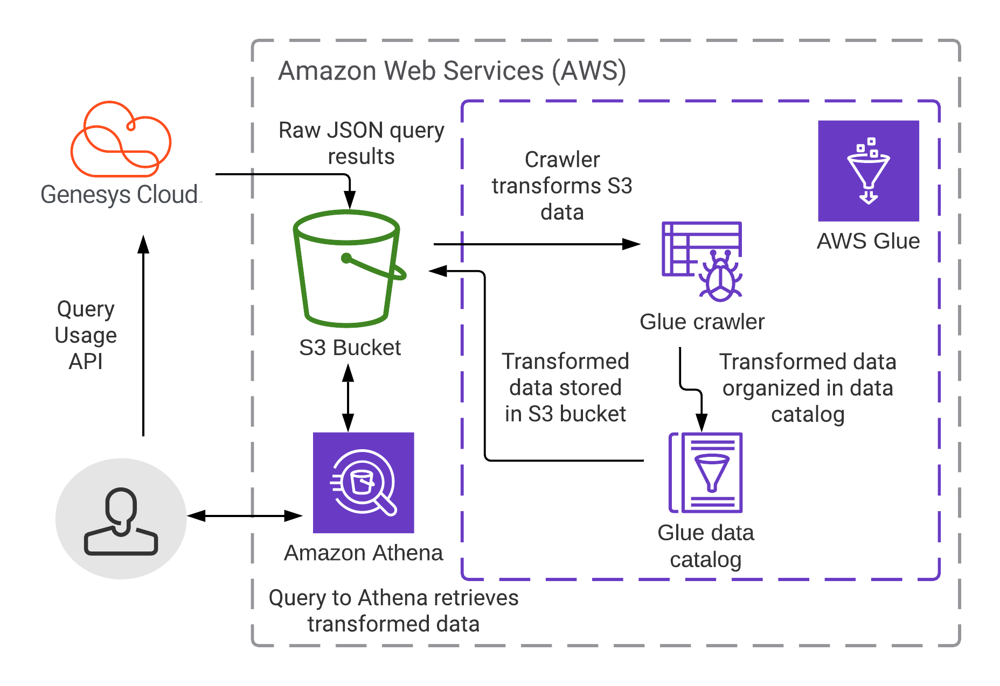

This Genesys Cloud Developer Blueprint demonstrates how to use the Genesys Cloud command line interface (CLI) to query your organization's API usage. Analyzing API usage is essential to optimize and scale any solution that uses the API. The blueprint provides a sample workflow that shows you how to monitor and analyze usage for unexpected issues that have business impact, such as rate limiting. This enables you to adjust any affected applications promptly. This blueprint also includes an example integration that shows how to export the usage data to an AWS S3 bucket and use AWS Athena to process queries against it.



* [Solution Components](#solution-components "Goes to the Solution Components section")
* [Prerequisites](prerequisites "Goes to the Prerequisites section")
* [Implementation Steps](#implementation-steps "Goes to the Implementation Steps section")
* [Additional Resources](#additional-resources "Goes to the Additional Resources section")

## Solution Components

* **Genesys Cloud** - A suite of Genesys cloud services for enterprise-grade communications, collaboration, and contact center management.
* **Genesys Cloud CLI** - A standalone command line interface (CLI) designed for interfacing with the Genesys Cloud API.
* **jq** - A lightweight and flexible command-line JSON processor. This blueprint uses it process and transform the JSON results from the Genesys Cloud API.
* **Amazon S3** - Simple Storage Service, an object storage service in AWS. This blueprint uses S3 buckets to host JSON data for analysis and store the results of AWS Athena queries.
* **Amazon Athena** - A serverless, interactive query service for querying data in Amazon S3 buckets using standard SQL.
* **AWS Glue** - A serverless data integration service that makes it easy to discover, prepare, and combine data for analytics, machine learning, and application development. This blueprint uses AWS Glue to auto-generate tables from your usage data files.
* **AWS CloudFormation** - A management tool that uses templates to write, deploy, and maintain your AWS infrastructure. This blueprint includes an AWS CloudFormation template used to deploy the AWS components of the solution.
* **AWS CLI** - A unified tool to manage your AWS services from the command line. In keeping with the 'command line' nature of the blueprint, it uses the AWS CLI an optional way to execute some of the implementation steps.

## Prerequisites

### Command Line Tools

* [Introducing the Genesys Cloud CLI](https://developer.genesys.cloud/blog/2021-02-11-Introducing-the-CLI/ "Opens the Introducing the Genesys Cloud CLI page") -  This blueprint assumes that the binary for the Genesys Cloud CLI is located in a PATH folder and is invokeable with `gc`. If you set it up differently, modify the sample code in the implementation steps as necessary.
* [jq - JSON Processor](https://stedolan.github.io/jq/ "Opens the jq GitHub repository") - This blueprint assumes that the jq binary is located in a PATH folder and is invokeable with `jq`. If you set it up differently, modify the sample code in the implementation steps as necessary.
* [AWS CLI](https://aws.amazon.com/cli/ "Opens the AWS Command Line Interface page") - Follow the instructions at this link to set up the AWS CLI for use in this blueprint.

### Genesys Cloud account requirements

This solution requires a Genesys Cloud license. For more information on licensing, see [Genesys Cloud Pricing](https://www.genesys.com/pricing "Opens the pricing article").

A recommended Genesys Cloud role for the solutions engineer is Master Admin. For more information on Genesys Cloud roles and permissions, see the [Roles and permissions overview](https://help.mypurecloud.com/?p=24360 "Opens the Roles and permissions overview article").

### AWS account requirements

An AWS account and administrator level credentials that allow you to:

* Work with AWS CloudFormation templates
* Work with AWS IAM permissions
* Create Amazon S3 buckets
* Create an AWS Glue datatable and crawler
* Create an Athena Workgroup

## Implementation Steps

<!-- no toc -->
* [Query the Genesys Cloud Usage API](#query-the-genesys-cloud-usage-api "Goes to the Query the Genesys Cloud Usage API section") - Explains how to construct a JSON file to query the Usage API using the Genesys Cloud CLI
* [Get the query status and results](#get-the-query-status-and-results "Goes to the Get the query status and results section")
* [Transform the JSON result for use with Amazon Athena](#transform-the-json-result-for-use-with-amazon-athena "Goes to the Transform the JSON result for use with Amazon Athena section")
* [Deploy the AWS CloudFormation template](#deploy-the-aws-cloudformation-template "Goes to the Deploy the AWS CloudFormation template section")
* [Upload the transformed JSON to an S3 bucket](#upload-transformed-json-to-s3-bucket "Goes to the Upload the transformed JSON to an S3 bucket section")
* [Run the AWS Glue crawler](#run-the-aws-glue-crawler "Goes to the Run the AWS Glue crawler section")
* [Run an Amazon Athena query](#run-an-amazon-athena-query "Goes to the Run an Amazon Athena query section")

:::primary
**Note**: This procedure assumes you have installed the Genesys Cloud CLI and jq.
* If you have not already done so, set up the CLI using the instructions in [Command Line Interface (CLI)](https://developer.genesys.cloud/api/rest/command-line-interface/ "Opens the Command Line Interface (CLI) page") in the Developer Center. Configure it to respond to the command `gc`.
* If you have not already done so, download jq from [download jq](https://stedolan.github.io/jq/download/ "Opens the download jq page"). Configure it to respond to the command `jq`.

:::

### Query the Genesys Cloud Usage API

The Genesys Cloud CLI takes a JSON file, named query-file.json in this blueprint, and uses it to query the Genesys Cloud Usage API without any need to write code to perform the query. The following code shows the complete body of the JSON file:

```json
{
  "interval": "",
  "granularity": "",
  "groupBy": [],
  "metrics": []
}
```

The 4 components of the query are:

1. `interval` (required). Defines the time period for which you want to get API usage data. This value is a date range which follows the ISO-8601 date format.

    * Example: `2020-01-25/2020-03-10`

2. `granularity` (optional). Specify whether to group the results by one of the following values:  `Day`, `Week`, or `Month`. If do not specify a value for granularity, all results in the specified interval are returned in a single group.
3. `groupBy` (array, optional). Behaves like the SQL GROUPBY command. Returns the query results grouped by the specified value. Valid values: OAuthClientId, OrganizationId, UserId, TemplateUri, HttpMethod.
4. `metrics` (array, optional). Behaves like the SQL SELECT clause and returns only the usage values that correspond to the value or values you specify. If you do not specify a metric, the Usage API returns all results. Valid values: Status200, Status300, Status400, Status500, Status429, Requests.

After you create your JSON file, open the Genesys Cloud CLI and submit a query using the following command:

```bash
gc usage query create -f query-file.json
```

Alternatively, you can build the JSON and invoke the CLI at the same time. The following one-line code example shows the format and jq arguments to use. To use the example, copy it and replace the argument values with those appropriate for your environment. Omit any optional arguments you don't need.

```bash
echo {} | jq --arg interval "2021-01/2021-02" --arg granularity "Month" --argjson groupBy '["OAuthClientId"]' --argjson metrics '["Status200", "Status429"]' '.interval=$interval | if $ARGS.named.granularity != null then .granularity=$ARGS.named.granularity else . end | if $ARGS.named.groupBy != null then .groupBy=$ARGS.named.groupBy else . end | if $ARGS.named.metrics != null then .metrics=$ARGS.named.metrics else . end' | gc usage query create
```

After you submit the query, the CLI returns an output similar to the following:

```json
{
  "executionId": "7157a113-2751-4e38-85c4-c386cb9e22a4",
  "resultsUri": "/api/v2/usage/query/7157a113-2751-4e38-85c4-c386cb9e22a4/results"
}
```

### Get the query status and results

To retrieve the query, execute the following command to send the `executionId` value to the Usage API:

```bash
gc usage query results get 7157a113-2751-4e38-85c4-c386cb9e22a4
```

If the query is not yet complete, the API returns the following JSON payload, indicating the query is in the `Running` status:

```json
{
  "queryStatus": "Running"
}
```

If the query is completed, the API returns the following JSON payload indicating that the `queryStatus` is equal to `Complete`. The payload also contains the results for the query you submitted.

Example of a completed query:

```json
{
  "results": [
    {
      "clientId": "e7de8a75-86bb-43eb-9063-38699f8c21af",
      "clientName": "Prince Implicit Grant",
      "organizationId": "",
      "userId": "",
      "templateUri": "",
      "httpMethod": "",
      "status200": 57,
      "status300": 0,
      "status400": 0,
      "status500": 0,
      "status429": 0,
      "requests": 57
    },
    {
      "clientId": "257acb58-bf3e-4e01-afd2-ae00a848fe",
      "clientName": "Github Pages (implicit)",
      "organizationId": "",
      "userId": "",
      "templateUri": "",
      "httpMethod": "",
      "status200": 10,
      "status300": 0,
      "status400": 0,
      "status500": 0,
      "status429": 0,
      "requests": 10
    },
    ...  Data truncated for conciseness
  ],
  "queryStatus": "Complete"
}
```

This step retrieves the raw data you requested from the Usage API. The remaining sections of this blueprint explain how to upload that data for use with Amazon Athena, which enables you to efficiently query the data.

### Transform the JSON result for use with Amazon Athena

To query the returned data with Amazon Athena, you must transform it into a JSON format where each record is on its own line. Athena requires this format.

The following one-line code example shows how to pipe the results into a jq transformation command, and then to save the new format in a new file:

```bash
gc usage query results get "7157a113-2751-4e38-85c4-c386cb9e22a4" | jq -c '.results[]' > query-result.json
```

The following is an example of what the resulting file looks like:

```json
{"clientId":"d57acb58-54a8-44ce-bafa-0c273a357a94","clientName":"Sample Client Credentials","organizationId":"","userId":"","templateUri":"","httpMethod":"","status200":3,"status300":0,"status400":0,"status500":1,"status429":0,"requests":4,"date":"2021-01-12T00:00:00Z"}
{"clientId":"47de8a75-c884-487c-bd30-f4b476622bb7","clientName":"Another OAUth Client","organizationId":"","userId":"","templateUri":"","httpMethod":"","status200":16,"status300":0,"status400":0,"status500":0,"status429":0,"requests":16,"date":"2021-01-29T00:00:00Z"}
...
```

### Deploy the AWS CloudFormation template

This blueprint includes an AWS CLoudFormation template that deploys an AWS stack containing the following resources for use in the remaining procedures:
* S3 bucket for hosting raw JSON data
* S3 bucket for results of Amazon Athena queries
* Policy, Role, Database, and Crawler for AWS Glue
* Athena Workgroup

Download the template from the Git repository for this blueprint: [usage-api.template.yaml](https://github.com/GenesysCloudBlueprints/usage-api-blueprint/tree/main/blueprint/src "Opens the Git repository src folder for the Usage API Blueprint")

To deploy the template, complete the following procedure:

1. Log into the AWS Console.
2. Click the [CloudFormation service](https://console.aws.amazon.com/cloudformation/home#/stacks/create/template) to a create a new stack.
3. Confirm the default selection of **Template is ready** and select **Upload a template file**.
4. Upload the **usage-api.template.yaml** file you downloaded.
5. Click **Next** to finish the process. There are no additional parameters to be configured.

:::primary
**Note**: The creation process can take several minutes. Make sure that it is completed before proceeding.
:::

:::warning
**Warning**: Most of the resources provisioned have explicitly set names for use in the following steps. If the creation process fails due to a naming conflict with existing objects, modify the template to eliminate the naming conflicts.
:::

### Upload the transformed JSON to an S3 bucket

If you have been following the same commands from the start, then you'll notice that we passed in a `granularity` value of `Month` for the usage query. Taking note of the value used is important, because you need to partition these files in the S3 buckets. The reason is that the properties of the query response have identical schema.

Take the following example:

```json
{
  "clientId":"xxxxxxxx-eb18-4804-9ec9-5673e2a4b5f4",
  "clientName":"Sample Client Credentials",
  ... Other properties redacted for conciseness ...
  "status200":145,
  "status300":0,
  "status400":0,
  "status500":0,
  "status429":12,
  "date":"2020-11-01T00:00:00Z"
}
```

Without the context from the original request, there's no way to tell if the status data enumerated are from the entire month or only for that specific day.

:::primary
**Note**: When using `granularity = "Month"`, it will always show the first day of the month in the date property.
:::

To partition the S3 bucket, create separate folders for the each granularity value. The following example shows the structure used when the JSON files are uploaded according to the `granularity` property:

```bash
s3://gc-usage-api-source/granularity=day/
s3://gc-usage-api-source/granularity=week/
s3://gc-usage-api-source/granularity=month/
```

:::primary
**Note**: AWS Glue produces a single table even if the files are in different folders. It adds a new column, `granularity`, which determines the granularity value of the partitioned entries.
:::

If you have the AWS CLI configured and ready to use, you can simply call the following command from your command line. It automatically creates the required folder.

```bash
aws s3 cp query-result.json s3://gc-usage-api-source/granularity=month/
```

If you prefer to use the web AWS Console, follow the instructions in [Step 2: Upload a File to Your Amazon S3 Bucket](https://docs.aws.amazon.com/quickstarts/latest/s3backup/step-2-upload-file.html) from the _AWS Quick Start Guide_.

### Run the AWS Glue crawler

After you have uploaded all the data to the `gc-usage-api-source` S3 bucket, run the AWS Glue Crawler to generate the table definitions. This crawler is configured to run on demand. You must run it manually each time there is a change in the S3 bucket.

Use the following command to run the crawler:

```bash
aws glue start-crawler --name UsageApiCrawler
```

Depending on the amount of data, the crawler can take up to several minutes. To poll the status of the crawler, run the following command:

```bash
aws glue get-crawler --name UsageApiCrawler | jq '.Crawler.State'
```

If the crawler state is `READY`, you can use Athena to query your data.

### Run an Amazon Athena query

Everything should now be set up for querying the data with Amazon Athena. The following example shows how to get the ten Authorization Clients that have the most occurrences of `Status429` (the error code for too many requests).

```bash
aws athena start-query-execution --query-string "SELECT * FROM "genesysclouddb"."gc_usage_api_source" WHERE granularity='month' ORDER BY status429 DESC limit 10" --work-group "UsageAPIWorkgroup" --query-execution-context Database=genesyscloud,Catalog=AwsDataCatalog
```

By default, your query results are saved to the `gc-usage-api-results` bucket.

:::primary
**Note**: If you have successfully set up this integration, you should now find it straightforward to integrate with other Amazon services.
:::

## Additional Resources

* [Genesys Cloud Developer Center](https://developer.genesys.cloud/ "Opens the Genesys Cloud Developer Center page")
* [Understanding your Genesys Cloud API usage](https://developer.genesys.cloud/blog/2021-01-04-API-Usage/ "Opens the Understanding your Genesys Cloud API usage page")
* [Rate Limits](https://developer.genesys.cloud/api/rest/rate_limits "Opens the Rate Limits page")
* [Amazon Athena - Best Practices for Reading JSON Data](https://docs.aws.amazon.com/athena/latest/ug/parsing-JSON.html "Opens the Best Practices for Reading JSON Data page")
